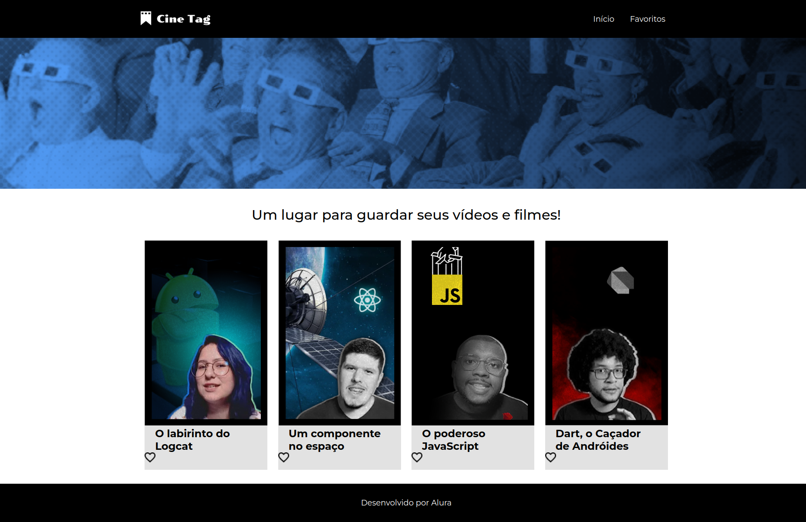
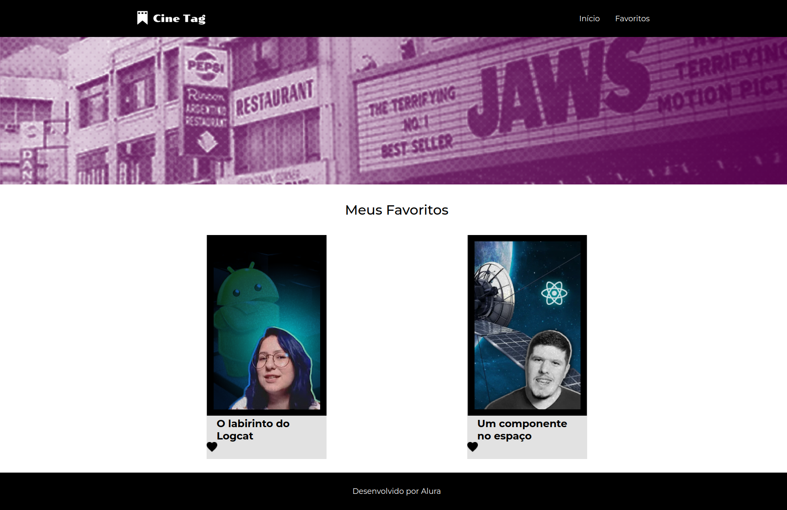
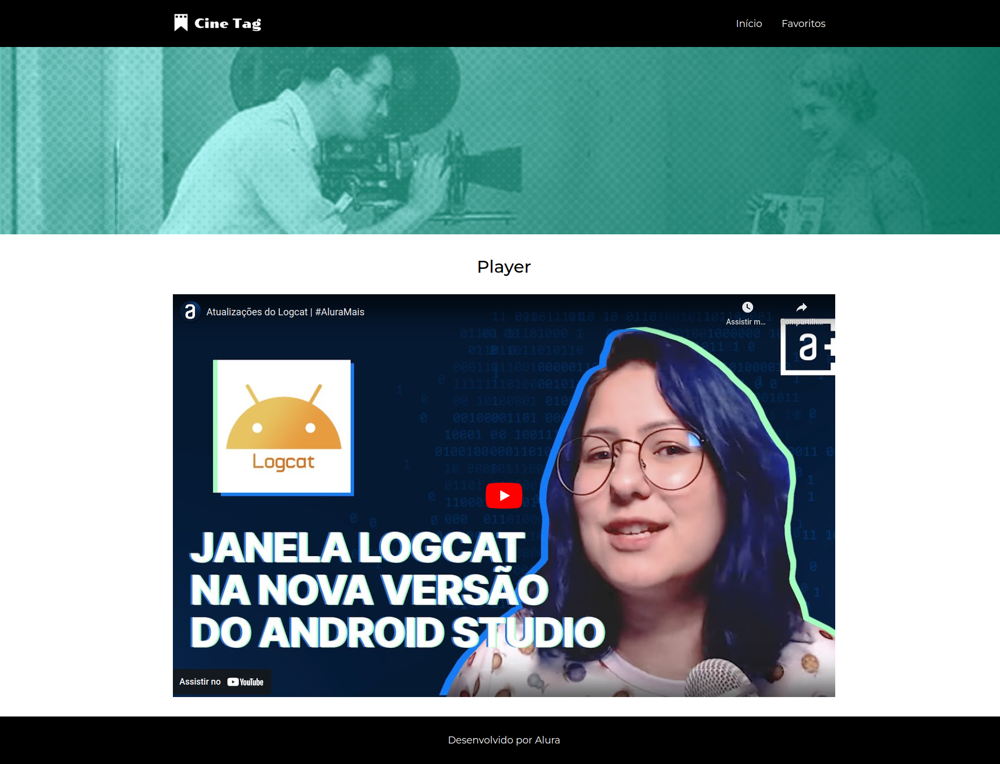
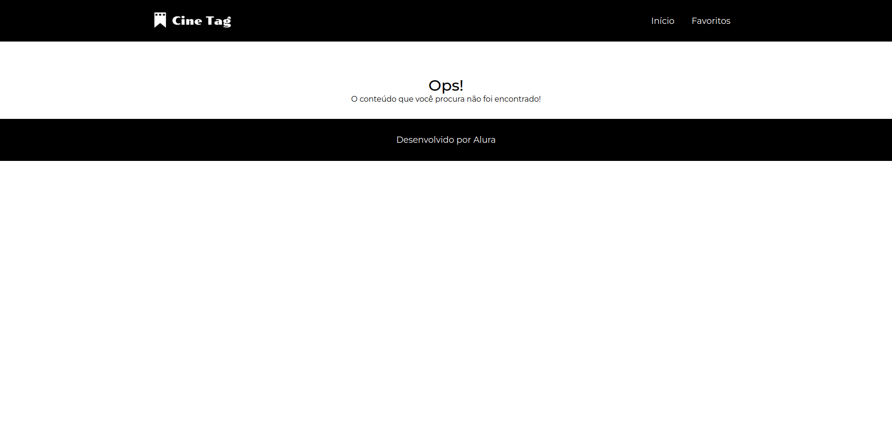

# CineTag

## Finalidade do Projeto

- Routes: Implementação de rotas para navegação entre diferentes páginas.
- Context API: Gerenciamento de estado global para evitar prop drilling.
- Hooks Personalizados: Criação de hooks reutilizáveis para lógica específica.
- Página Padrão: Página principal que renderiza o conteúdo.
- Página NotFound: Página para exibir uma mensagem quando a rota não é encontrada.
- Favoritar Cards: Função para favoritar vídeos exibidos em formato de cards.
- Página Player: Ao clicar na imagem de um card, o usuário é redirecionado para uma página onde pode assistir ao vídeo.

O projeto CineTag foi desenvolvido com a finalidade de praticar e aplicar conhecimentos adquiridos em diversas áreas da programação com React, incluindo:

Este projeto foi desenvolvido utilizando a biblioteca react-router-dom, explorando seus principais recursos, como rotas aninhadas e dinâmicas, além de hooks como useLocation, useParams, useNavigate, Outlet, e componentes como Link. O projeto também faz uso de funções JavaScript como map, filter etc.

:dizzy: Tecnologias utilizadas

<div>
  
  
  
  
</div>
  
:hammer: Estruturação e Configuração de Caminho Relativo

Para facilitar a importação de componentes e melhorar a organização do código, foi utilizada a configuração de caminho relativo no Vite:

```js
import { defineConfig } from 'vite';
import react from '@vitejs/plugin-react';
import path from 'path';

export default defineConfig({
  plugins: [react()],
  resolve: {
    alias: {
      '@': path.resolve(__dirname, './src'),
    },
  },
});
```

Com essa configuração, é possível importar componentes usando caminhos relativos a partir da raiz do projeto, o que melhora a legibilidade e manutenção do código.

## :camera_flash: Capturas de Tela

### Página Inicial



### Página de Favoritos



### Página de Reprodução de vídeos



### Página Não Encontrada



## :globe_with_meridians: Acesso ao Deploy do projeto

### Vercel

O projeto está disponível na Vercel. Você pode acessá-lo através do seguinte link: 

[CineTag na Vercel.](https://cine-tag-beryl.vercel.app)

## :warning: Como Executar o Projeto

### :dvd: Passo a Passo

1. Clone o repositório:

   ```bash
   git clone https://github.com/charlesbrcosta/CineTag.git


2. Navegue até o diretório do projeto:
    ```bash
    cd CineTag

3. Instale as dependências:
    ```bash
    npm install ou npm i

4. Inicie o servidor de desenvolvimento:
    ```bash
    npm run dev

## Considerações Finais

Espero que este projeto ajude você a entender melhor o uso de Routes, Context API, hooks personalizados e estruturação de projetos em React. Boa programação! 🚀

## :handshake: Contribuição

Se você quiser contribuir com o projeto, siga os passos abaixo:

    Faça um fork deste repositório.
    Crie uma nova branch (git checkout -b feature/nova-feature).
    Faça commit das suas alterações (git commit -am 'Adiciona nova feature').
    Faça push para a branch (git push origin feature/nova-feature).
    Abra um Pull Request.

## :student: Autor

[<br><sub>Charles Bruno</sub>](https://github.com/charlesbrcosta)


## :page_facing_up: Licença

Este projeto está licenciado sob a [Licença MIT](https://www.mit.edu/~amini/LICENSE.md).